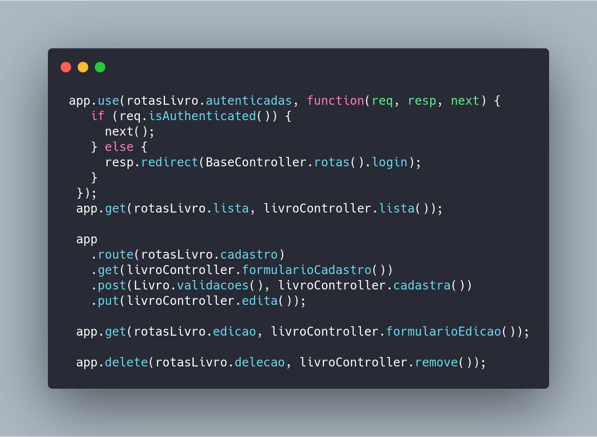
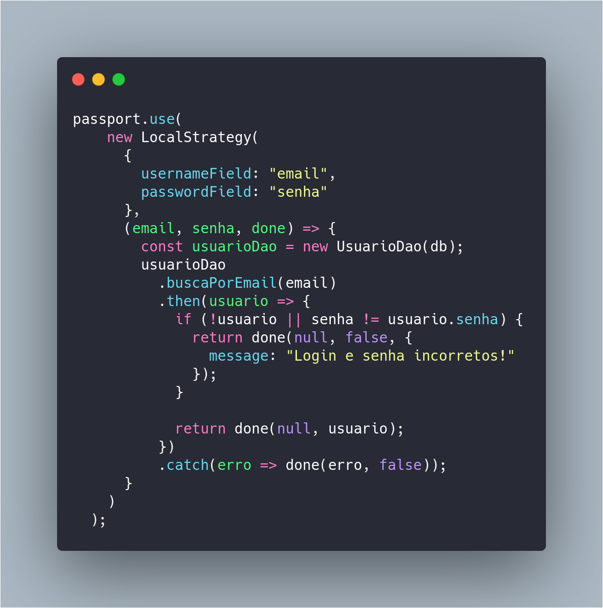

# Aplicação API com Node.js

### Utilizando verbos HTTP

##### { DELETE, GET, PUT, POST }

#### Utilizando Passport para Autenticação

<ul>
<li>Express</li>
<li>Express Session</li>
<li>Express Validator</li>
<li>Marko for HTML5</li>
<li>Method Override</li>
<li>Morgan</li>
<li>Passport</li>
<li>Passport Local</li>
<li>SqLite</li>
<li>Uuid</li>
<li>Nodemon</li>

</ul>

#### Utilização do git hooks

<ul>
<li>Husky</li>
<li>Prettier</li>
</ul>
